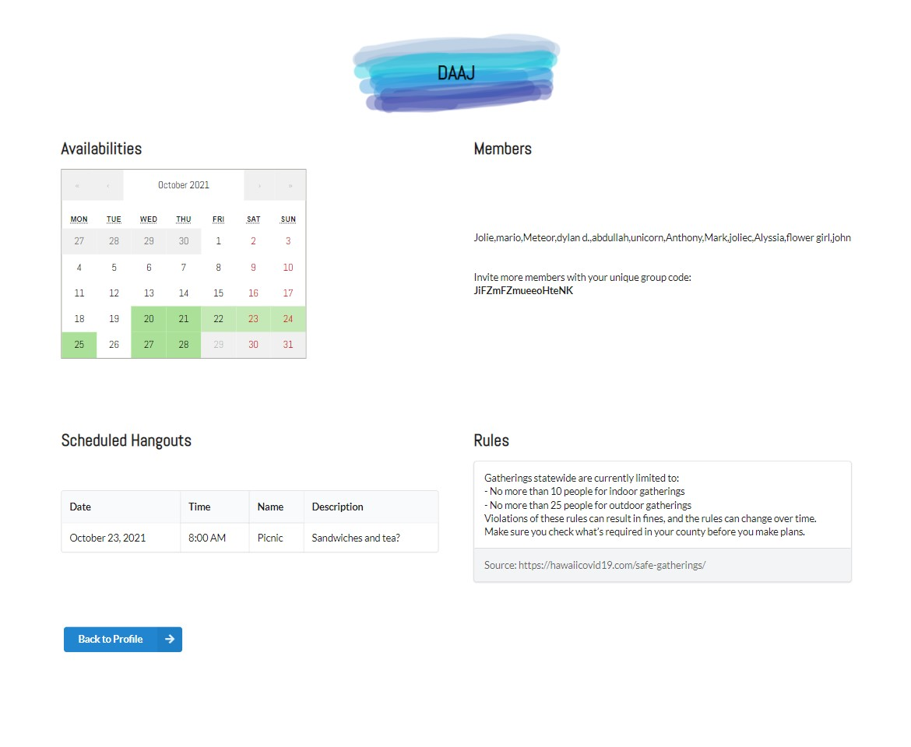

For details about the template, please see http://ics-software-engineering.github.io/meteor-application-template-react/

# Meteor Hackathon
[Our Deployed Application](https://proxamie.meteorapp.com/#/)
<!-- Proxamie -->

## Table of contents

* [Overview](#overview)
* [Team Members](#team-members)
* [Landing Page](#landing)
* [Sign-in/Register Page](#sign-in--register)
* [Profile Page](#profile-page)
* [Add Availability Page](#add-availability)
* [Create Group Modal](#create-group)
* [Join Group Modal](#join-group)
* [Group Page](#group-page)
* [Create Hangout Modal](#create-hangout)

## Overview
As a consequence of the COVID-19 pandemic, many people have lost out on the opportunity to connect with friends and family with some people reporting feelings of loneliness and depression because of this loss of social interaction. However, now there are trends that are showing that people are starting to hangout more again.  To help facilitate, support, manage and help initiate these kind of activity in a safe manner, our application, Proxamie seeks to help people easily schedule hangouts with their friends with the necessary COVID-19 safety precautions in mind. By using this app, people will be able to better keep track of their social bubbles and to be more aware of who they've been in contact with for the past 2 weeks. To support these functions, users are able to create groups and invite their friends to groups. Then the app helps users find the times when the most people in the group are available and records the attendees and dates (and other information) once hangouts are set. This app was built over the course of six days (Oct 15-20, 2021) as our group's submission for the [2021 Meteor Hackathon](https://impact.meteor.com/hackathon), using [meteor-application-template-react](http://ics-software-engineering.github.io/meteor-application-template-react/) as a base.

## Team Members

* [Mujtaba Quadri](https://github.com/mujtaba-a-quadri)
* [Alyssia Chen](https://github.com/alyssia-chen)
* [Jolie Ching](https://github.com/jolieching)
* [Dylan Decker](https://github.com/dylandecker)

## Landing

This page serves as the main landing for the website.
From here, the user can press the log-in button to either sign in or register. 

## Sign-In / Register

To unlock full functionality of the app, the user must sign-in to the page with their credentials.
If they do not have an account, they will have the ability to register for one, this form includes a username field, which is used on the profile and group pages. The email is not displayed, but is used for logging in.

  
  

## Profile Page
Once users sign in, they are placed onto the profile page. From here, a user can see a calendar which indicates their last recorded availability. Below the calendar is a button that redirects users to a page to redo their availability. On the bottom, there is an interest form which helps the user keep track of what hangout ideas they could be interested in for the future. These records are displayed in the bottom right under “My Interests”. We initially wanted to use these interests for planning hangouts, but ran out of time to implement it. If we could have, we would have promoted COVID-safer activities such as being outdoors or remote activitie such as gaming. On the right, there are two buttons: one to open a modal for creating a group and one for joining a group. Below the buttons is a list of groups this user has joined. When a user clicks on the group name, they will be redirected to a page dedicated to that group. Finally, underneath the “Contacted” header is a list of people this user has been in contact with in the past 2 weeks through hangouts created in Proxamie.

## Add Availability
On the add availabilities page, users can use the handy calendar (the package we used for this is called react-schedule-selector) that allows dragging to indicate their availability for the upcoming 7 days. As soon as they use the calendar, their availability is stored into the database.

## Create Group
Groups are an essential component of our application (for more information, visit the [Group Page](#group-page) section). 
Users will use the **Create Group** modal to start a group that other users can join from the Join Group modal which is discussed in more detail under [this section](#join-group). Once the user clicks submit, a unique group ID will be generated for the group, so members can view details (such as availabilities) on a per pergroup basis.

## Join Group
Users have the ability to join an existing group by using the group code indicated at the top of the Group Page. They simply have to enter it into the modal that appears when Join Group is clicked, and voilà, they will be taken to the respective group page!

## Group Page
The Group Page consists of the availabilities calendar (a cumulative calendar of all member's schedules), member display, a COVID rules reminder, and the schedule hangouts list. The calendar changes to a deeper shade of green based on the number of available people on that particular day. 

## Create Hangout
After clicking on a date on the group page, you can create a hangout that will be visible on the group page. You select the time of the hangout (selected from a dropdown of people's available times), and input a name and description for the hangout. If a hangout is proposed for a time when many people (more than 10) are available, a warning will appear. Otherwise, the scheduled hangout will be noted in the bottom left of the Group Page, and then contacted list per user (on the Profile Page) is updated.

 

  
  

